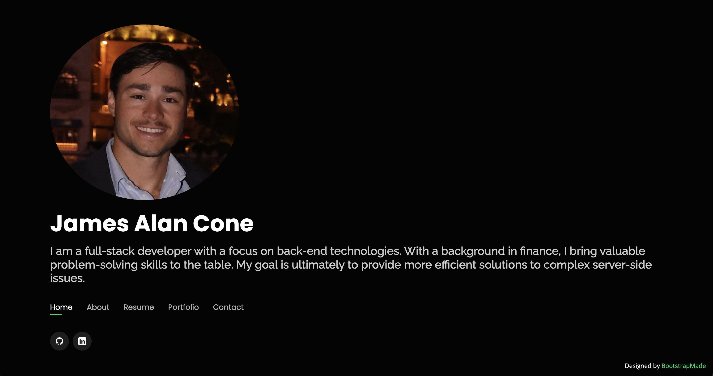

# Portfolio Website

## Description
This Portfolio website was created to showcase my current work and give a little detail about my background. The first section is information on my background and why I chose to pursue coding. In the next section, there are links to some of my current projects. The final section provides my contact information as well as a link to my personal github account, which contains additional projects.

## Installation
N/A

## Usage
The webpage is designed with a homepage that displays my name, a short intro, and links to other parts of my portfolio. These include an about section, my resume, my portfolio, and my contact information. By clicking on these links, you are taken to that section of my portfolio website. Below is a picture of my homepage. 

Below is a link to the active website:

https://jacone626.github.io/portfolio-website/

## Credits
N/A

## License
Please refer to the license in the repo.