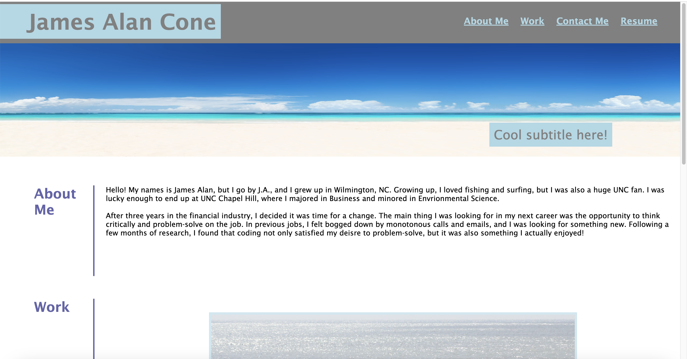

# Portfolio Website

## Description
This Portfolio website was created to showcase my current work and give a little detail about my background. THe first section is infromation on my background and why I chose to pursue coding. In the next section, there are links to some of my current projects. The final section provides my contact information as well as  a link to my personal github account, which contains additional projects.

## Installation
N/A

## Usage
The webpage is designed with a header at the top that links down to the corresponding section. For example, when you click on "Contact Me" at the top of the page, you will be directed to that section of the webpage. Further down, in the "Work" section, you will find photos that light up when you hover over them. By clicking on the photo, you will then be directed to a project that's related to the photo caption. At this time, only the "Run Buddy" photo links to a live webpage. In the final section, "Contact Me", you will find links to my phone number, email, and github. You can click on these links to be routed to the correct page. 

Please note that this site has minimal resposiveness at this time and functions best at around 1400px in width. I have been attempting to make the site function better at different widths, but am struggling with the code and formatting. The picture below shows a view of the webpage on a laptop screen. 

Below is a link to the active website:

https://jacone626.github.io/portfolio-website/

## Credits
N/A

## License
Please refer to the license in the repo.